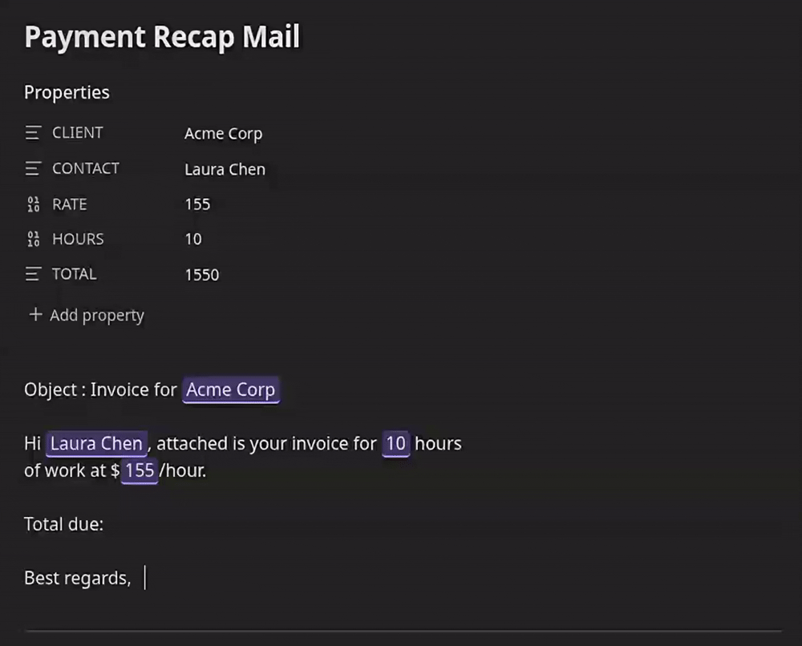

# Inline Properties

<div align="center">



</div>

An [Obsidian](https://obsidian.md) plugin that lets you reference note properties as inline variables anywhere in your vault using `{{variable}}` syntax. Values render inline in both Live Preview and Reading mode.

## How it works

Add variables to a note's frontmatter (Properties):

```yaml
---
project: Acme Corp
rate: 150
---
```

Then use them anywhere in that note, or anywhere else in the vault:

```
The project **{{project}}** runs at ${{rate}}/hour.
```

The `{{variable}}` token is replaced inline as you type. Hovering a rendered value briefly reveals the raw `{{...}}` source so you can edit it. When you copy text containing variables, the resolved values are copied, not the raw `{{...}}` syntax.

## Variable scope

| Syntax | Resolves to |
|---|---|
| `{{name}}` | Property `name` from the current note's frontmatter |
| `{{Notes/Budget.md.rate}}` | Property `rate` from `Notes/Budget.md` |
| `{{Clients/Acme.md.contact.email}}` | Nested frontmatter property in another note |

Local (current note) properties take priority over vault-wide references when names collide.

## Autocomplete

Type `{{` in any note to trigger autocomplete. Matching is fuzzy and **name-first**: type a fragment of a variable name (you don't need the path) to find it anywhere in the vault. Each suggestion shows the variable name prominently with its originating path as a muted reference on the side, plus a value preview. Selecting a suggestion inserts the full `{{path}}` reference and handles Obsidian's auto-closing brackets automatically.

## Settings

| Setting | Default | Description |
|---|---|---|
| Highlight live text | Off | Adds a visual highlight to rendered variable values |
| Copy resolved values | On | When copying text, replaces `{{var}}` with its current value instead of the raw syntax |

### Custom highlighting

Override the `.lv-live-text` CSS class in a CSS snippet:

```css
.lv-live-text {
    background-color: transparent;
    border-bottom: 2px solid var(--color-accent);
    border-radius: 0;
    padding: 0;
}
```

## Installation

This plugin is not yet in the Obsidian community plugin list. To install manually:

1. Download `main.js`, `manifest.json`, and `styles.css` from the latest release.
2. Copy them to `<vault>/.obsidian/plugins/live-variables/`.
3. Reload Obsidian and enable the plugin under **Settings → Community plugins**.

## Development

```bash
npm install
npm run dev      # watch mode
npm run build    # production build
```

Targets Obsidian `0.15.0+`, compatible with desktop and mobile.

## Philosophy

This plugin does one thing: inline variable substitution. The codebase is intentionally minimal to stay easy to maintain. There are no plans to add new features. Future work is limited to improving what is already here.

## Credits

Forked from [HamzaBenyazid/Live-variables](https://github.com/HamzaBenyazid/Live-variables). Refactored to a CodeMirror 6 ViewPlugin for Live Preview and a native `EditorSuggest` for autocomplete.
